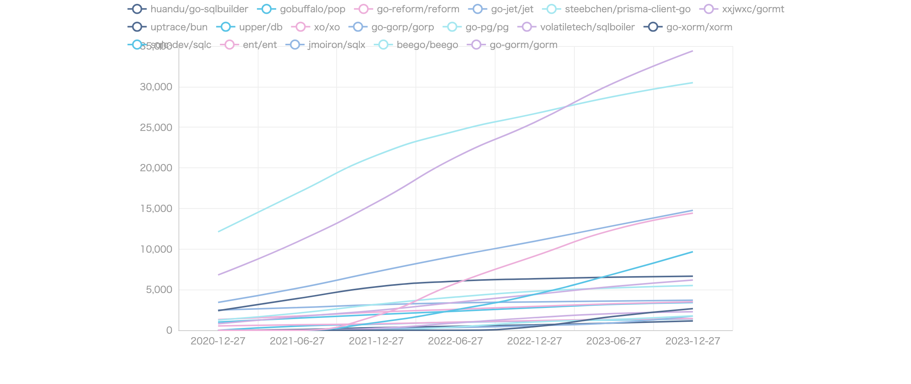

# Golang ORMapper Star 🎉🎉
The number of stars is expressed in an easy-to-understand manner for golang ormapper information with more than 1,000 stars. It can also display the number of stars at different times of the year.
If there are any other public repositories of golang orMapper, I'd be glad to hear about them!

| No. | Project Name | Stars | Subscribers | Forks | Open Issues | Description | Createdate | Last Update |
| --- | ------------ | ----- | ----------- | ----- | ----------- | ----------- | ----------- | ----------- |
| 1 | [go-gorm/gorm](https://github.com/go-gorm/gorm) | 32958 | 495 | 3631 | 232 | The fantastic ORM library for Golang, aims to be developer friendly | 2013-10-25 08:31:38 | 2023-07-12 11:08:45 |
| 2 | [beego/beego](https://github.com/beego/beego) | 29958 | 1210 | 5602 | 12 | beego is an open-source, high-performance web framework for the Go programming language. | 2012-02-29 02:32:08 | 2023-07-12 09:22:39 |
| 3 | [jmoiron/sqlx](https://github.com/jmoiron/sqlx) | 13908 | 197 | 1027 | 327 | general purpose extensions to golang's database/sql | 2013-01-28 19:40:00 | 2023-07-12 07:52:51 |
| 4 | [ent/ent](https://github.com/ent/ent) | 13744 | 148 | 824 | 320 | An entity framework for Go | 2019-06-12 22:53:55 | 2023-07-12 06:48:47 |
| 5 | [kyleconroy/sqlc](https://github.com/kyleconroy/sqlc) | 8492 | 69 | 574 | 358 | Generate type-safe code from SQL | 2019-06-21 21:11:35 | 2023-07-12 11:10:24 |
| 6 | [go-xorm/xorm](https://github.com/go-xorm/xorm) | 6636 | 266 | 772 | 307 | Simple and Powerful ORM for Go, support mysql,postgres,tidb,sqlite3,mssql,oracle, Moved to https://gitea.com/xorm/xorm | 2013-05-09 02:35:04 | 2023-07-12 08:42:43 |
| 7 | [volatiletech/sqlboiler](https://github.com/volatiletech/sqlboiler) | 5885 | 75 | 508 | 88 | Generate a Go ORM tailored to your database schema. | 2016-02-21 06:18:25 | 2023-07-12 02:54:36 |
| 8 | [go-pg/pg](https://github.com/go-pg/pg) | 5427 | 90 | 397 | 115 | Golang ORM with focus on PostgreSQL features and performance | 2013-04-24 12:31:41 | 2023-07-11 16:20:52 |
| 9 | [go-gorp/gorp](https://github.com/go-gorp/gorp) | 3673 | 108 | 380 | 145 | Go Relational Persistence - an ORM-ish library for Go | 2012-01-04 19:50:09 | 2023-07-10 14:51:07 |
| 10 | [xo/xo](https://github.com/xo/xo) | 3391 | 71 | 306 | 44 | Command line tool to generate idiomatic Go code for SQL databases supporting PostgreSQL, MySQL, SQLite, Oracle, and Microsoft SQL Server | 2016-02-05 10:22:20 | 2023-07-11 18:50:38 |
| 11 | [upper/db](https://github.com/upper/db) | 3348 | 64 | 238 | 158 | Data access layer for PostgreSQL, CockroachDB, MySQL, SQLite and MongoDB with ORM-like features. | 2013-10-23 02:04:36 | 2023-07-10 08:26:14 |
| 12 | [xxjwxc/gormt](https://github.com/xxjwxc/gormt) | 2212 | 22 | 340 | 57 | database to golang struct | 2019-05-05 13:10:26 | 2023-07-12 02:07:26 |
| 13 | [uptrace/bun](https://github.com/uptrace/bun) | 2200 | 26 | 161 | 109 | SQL-first Golang ORM | 2021-05-03 11:40:52 | 2023-07-12 11:18:34 |
| 14 | [steebchen/prisma-client-go](https://github.com/steebchen/prisma-client-go) | 1549 | 26 | 84 | 104 | Prisma Client Go is an auto-generated and fully type-safe database client | 2019-09-24 12:17:03 | 2023-07-11 14:01:22 |
| 15 | [go-reform/reform](https://github.com/go-reform/reform) | 1419 | 25 | 72 | 86 | A better ORM for Go, based on non-empty interfaces and code generation. | 2016-02-25 09:41:09 | 2023-06-28 11:21:48 |
| 16 | [gobuffalo/pop](https://github.com/gobuffalo/pop) | 1345 | 23 | 237 | 98 | A Tasty Treat For All Your Database Needs | 2018-02-07 21:13:46 | 2023-07-11 22:19:35 |
| 17 | [go-jet/jet](https://github.com/go-jet/jet) | 1331 | 19 | 79 | 25 | Type safe SQL builder with code generation and automatic query result data mapping | 2019-03-02 11:06:23 | 2023-07-12 00:54:23 |
| 18 | [huandu/go-sqlbuilder](https://github.com/huandu/go-sqlbuilder) | 1044 | 12 | 99 | 9 | A flexible and powerful SQL string builder library plus a zero-config ORM. | 2017-12-27 16:37:48 | 2023-07-12 07:34:30 |
## [go-gorm/gorm](https://github.com/go-gorm/gorm)
| 2020-07-12 | 2021-01-12 | 2021-07-12 | 2022-01-12 | 2022-07-12 | 2023-01-12 | 2023-07-12 |
| --- | --- | --- | --- | --- | --- | --- |
| 18549 | 21580 | 23752 | 25937 | 28491 | 30826 | 32958 |
## [beego/beego](https://github.com/beego/beego)
| 2020-07-12 | 2021-01-12 | 2021-07-12 | 2022-01-12 | 2022-07-12 | 2023-01-12 | 2023-07-12 |
| --- | --- | --- | --- | --- | --- | --- |
| 23360 | 24763 | 25849 | 26924 | 28008 | 29040 | 29958 |
## [jmoiron/sqlx](https://github.com/jmoiron/sqlx)
| 2020-07-12 | 2021-01-12 | 2021-07-12 | 2022-01-12 | 2022-07-12 | 2023-01-12 | 2023-07-12 |
| --- | --- | --- | --- | --- | --- | --- |
| 8328 | 9255 | 10191 | 11075 | 12084 | 13020 | 13909 |
## [ent/ent](https://github.com/ent/ent)
| 2020-07-12 | 2021-01-12 | 2021-07-12 | 2022-01-12 | 2022-07-12 | 2023-01-12 | 2023-07-12 |
| --- | --- | --- | --- | --- | --- | --- |
| 2728 | 5997 | 7359 | 9323 | 10964 | 12620 | 13744 |
## [kyleconroy/sqlc](https://github.com/kyleconroy/sqlc)
| 2020-07-12 | 2021-01-12 | 2021-07-12 | 2022-01-12 | 2022-07-12 | 2023-01-12 | 2023-07-12 |
| --- | --- | --- | --- | --- | --- | --- |
| 1947 | 2568 | 3157 | 4518 | 5779 | 7079 | 8492 |
## [go-xorm/xorm](https://github.com/go-xorm/xorm)
| 2020-07-12 | 2021-01-12 | 2021-07-12 | 2022-01-12 | 2022-07-12 | 2023-01-12 | 2023-07-12 |
| --- | --- | --- | --- | --- | --- | --- |
| 5861 | 6087 | 6226 | 6378 | 6469 | 6566 | 6636 |
## [volatiletech/sqlboiler](https://github.com/volatiletech/sqlboiler)
| 2020-07-12 | 2021-01-12 | 2021-07-12 | 2022-01-12 | 2022-07-12 | 2023-01-12 | 2023-07-12 |
| --- | --- | --- | --- | --- | --- | --- |
| 3072 | 3485 | 3952 | 4478 | 4970 | 5482 | 5885 |
## [go-pg/pg](https://github.com/go-pg/pg)
| 2020-07-12 | 2021-01-12 | 2021-07-12 | 2022-01-12 | 2022-07-12 | 2023-01-12 | 2023-07-12 |
| --- | --- | --- | --- | --- | --- | --- |
| 3731 | 4134 | 4575 | 4851 | 5065 | 5278 | 5427 |
## [go-gorp/gorp](https://github.com/go-gorp/gorp)
| 2020-07-12 | 2021-01-12 | 2021-07-12 | 2022-01-12 | 2022-07-12 | 2023-01-12 | 2023-07-12 |
| --- | --- | --- | --- | --- | --- | --- |
| 3305 | 3394 | 3451 | 3514 | 3556 | 3611 | 3673 |
## [xo/xo](https://github.com/xo/xo)
| 2020-07-12 | 2021-01-12 | 2021-07-12 | 2022-01-12 | 2022-07-12 | 2023-01-12 | 2023-07-12 |
| --- | --- | --- | --- | --- | --- | --- |
| 2417 | 2600 | 2759 | 2945 | 3125 | 3281 | 3391 |
## [upper/db](https://github.com/upper/db)
| 2020-07-12 | 2021-01-12 | 2021-07-12 | 2022-01-12 | 2022-07-12 | 2023-01-12 | 2023-07-12 |
| --- | --- | --- | --- | --- | --- | --- |
| 2136 | 2366 | 2588 | 2822 | 3061 | 3219 | 3348 |
## [xxjwxc/gormt](https://github.com/xxjwxc/gormt)
| 2020-07-12 | 2021-01-12 | 2021-07-12 | 2022-01-12 | 2022-07-12 | 2023-01-12 | 2023-07-12 |
| --- | --- | --- | --- | --- | --- | --- |
| 577 | 911 | 1245 | 1591 | 1894 | 2072 | 2212 |
## [uptrace/bun](https://github.com/uptrace/bun)
| 2020-07-12 | 2021-01-12 | 2021-07-12 | 2022-01-12 | 2022-07-12 | 2023-01-12 | 2023-07-12 |
| --- | --- | --- | --- | --- | --- | --- |
| - | - | 79 | 497 | 1158 | 1761 | 2200 |
## [steebchen/prisma-client-go](https://github.com/steebchen/prisma-client-go)
| 2020-07-12 | 2021-01-12 | 2021-07-12 | 2022-01-12 | 2022-07-12 | 2023-01-12 | 2023-07-12 |
| --- | --- | --- | --- | --- | --- | --- |
| 111 | 432 | 762 | 1049 | 1230 | 1355 | 1549 |
## [go-reform/reform](https://github.com/go-reform/reform)
| 2020-07-12 | 2021-01-12 | 2021-07-12 | 2022-01-12 | 2022-07-12 | 2023-01-12 | 2023-07-12 |
| --- | --- | --- | --- | --- | --- | --- |
| 839 | 1015 | 1128 | 1196 | 1265 | 1379 | 1419 |
## [gobuffalo/pop](https://github.com/gobuffalo/pop)
| 2020-07-12 | 2021-01-12 | 2021-07-12 | 2022-01-12 | 2022-07-12 | 2023-01-12 | 2023-07-12 |
| --- | --- | --- | --- | --- | --- | --- |
| 885 | 985 | 1076 | 1145 | 1211 | 1277 | 1345 |
## [go-jet/jet](https://github.com/go-jet/jet)
| 2020-07-12 | 2021-01-12 | 2021-07-12 | 2022-01-12 | 2022-07-12 | 2023-01-12 | 2023-07-12 |
| --- | --- | --- | --- | --- | --- | --- |
| 274 | 334 | 414 | 578 | 739 | 974 | 1331 |
## [huandu/go-sqlbuilder](https://github.com/huandu/go-sqlbuilder)
| 2020-07-12 | 2021-01-12 | 2021-07-12 | 2022-01-12 | 2022-07-12 | 2023-01-12 | 2023-07-12 |
| --- | --- | --- | --- | --- | --- | --- |
| 388 | 495 | 589 | 679 | 792 | 904 | 1044 |
